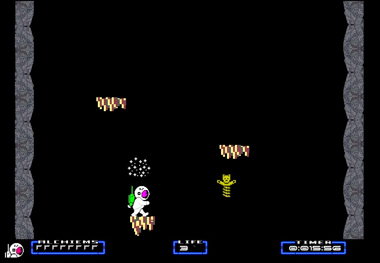

# Nodes of Yesod Typescript conversion

This is an ongoing project to convert the C# XNA version of Nodes of Yesod remake, to bring it to life on the Canvas through the power of Typescript.

The XNA Nodes of Yesod conversion of this great 8 bit platformer was started in 2010, unfortunately it was never completed.

A playable demo can be found at : http://ianwigley.co.uk/NodesOfYesod/index.html
Please be aware that this only a demo ! 
There's a whole load of unfinished stuff & it's rather buggy !!

Use the Left and Right arrow keys to walk left and Right.
Pressing the Ctrl key at the same time as either the Left or Right arrow with make you Somersault.
Pressing the Ctrl key alone will make you jump.

I intend to add Joypad and Touch Screen support in the near future.

